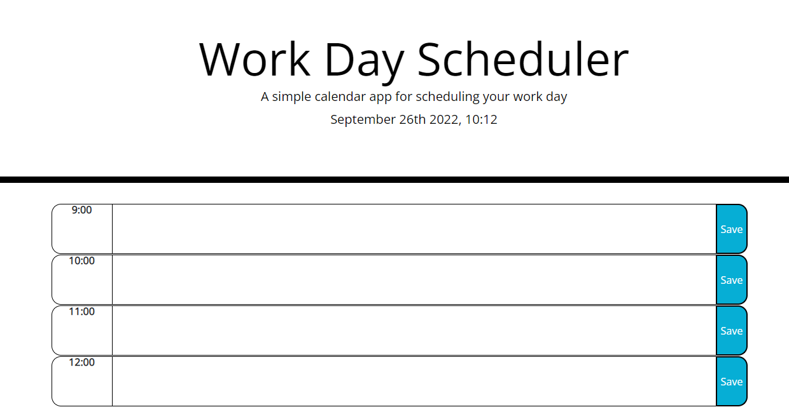

# Day Calendar

## Description

Creating a simple workday calendar planner. Time blocks should change color based on if that time is before or after the current time.
events should save to local storage.

https://theinterloper.github.io/05-day-calendar/

## Installation

N/A

## Usage

Daily planner for a standard work day of 9-5

## Credits

N/A

## License

N/A
